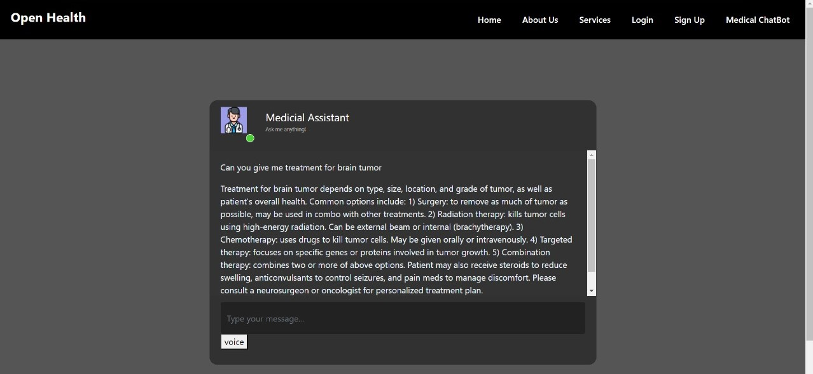

# Healthify
## your first-hand personal diagnosis

Healthify provides diagnosis around the below given diseases using ensemble models and ML techniques.

Diabetes
Brain Tumour 
Breast Cancer 
Lung Disease 

Additionally, Healthify features a dedicated medical assistant powered by Llama-3, our AI chatbot. Llama-3 is finely tuned to provide personalized assistance to medical professionals, capable of accepting voice inputs and delivering expert advice akin to a doctor's guidance. This feature enhances communication and collaboration between healthcare providers, ensuring efficient patient care.

We also provide a notification section for doctors to ask help from other doctors based on their specialization.
